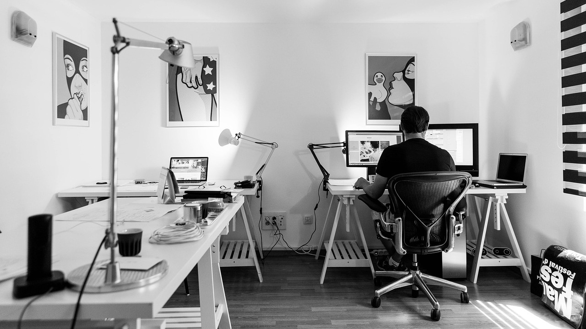

# Portfolio de Jérémy Darbellay

Dans ce projet de création de mon portfolio, j'ai utilisé Next.js pour construire un site simple en noir et blanc avec des animations légères. J'ai mis l'accent sur l'accessibilité, l'optimisation pour les moteurs de recherche et l'utilisation de markdown pour la publication. Le choix des technologies et du design a été un défi, mais Next.js s'est avéré être une excellente solution pour le routing et la génération de site statique. Ce projet m'a offert une vue globale de la mise en production d'un site vitrine et a renforcé mes compétences en Next.js.

# Sommaire
+ [Portfolio de Jérémy Darbellay](#portfolio-de-jérémy-darbellay)
+ [Sommaire](#sommaire)
+ [Installation et lancement](#installation-et-lancement)
+ [Démonstration](#démonstration)
+ [Technologies utilisées](#technologies-utilisées)
+ [License](#license)

# Installation et lancement

Voici les étapes à suivre pour lancer le projet en local :

Prérequis : Vous devez avoir nodejs et npm installés et fonctionnels, suivez ce lien pour installer les dernières versions stables : [installer Node.Js](https://nodejs.org/fr)

Voici les étapes à suivre pour lancer le projet en local :

1. créer le dossier qui contiendra le projet : `mkdir myNewProject`
2. cloner le projet dans ce dossier : `git clone https://github.com/JeremyDarbellay/projet_8_openclassrooms.git ./myNewProjet`
3. naviguer dans ce dossier : `cd myNewProject`
4. installer les modules associés : `npm install`
5. Lancez `npm run dev` pour lancer le site internet en local !

# Démonstration

Vous retrouverez la démonstration du site à cette adresse : [portfolio](https://jeremydarbellay.github.io/projet_8_openclassrooms/)

# Technologies utilisées

<!--  -->

J'ai utilisé plusieurs technologies, les voicis : Next.js, JsPdf et html2canvas (pour la génération du cv), fontawesome pour quelques icons et next-seo pour la génération simplifiée des balises metas.

# License

[MIT](https://github.com/JeremyDarbellay/projet_6_openclassrooms/blob/main/LICENSE.md)

